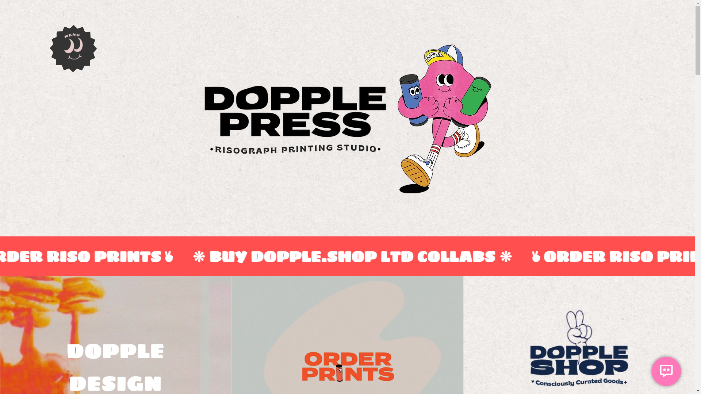

# Digital Skill Fair 34.0 - Risograph Printing Website 🎨

A modern, interactive website showcasing Risograph printing services with drag-and-drop color mixing, interactive galleries, and responsive design.

## 🌟 Features

### 📱 Modern Navigation

- Responsive hamburger menu
- Smooth sidebar transitions
- Social media integration
- Mobile-first approach

### 🎯 Key Sections

#### 1. Home Section

- Dynamic hero section
- Animated marquee announcements
- Seamless content flow

#### 2. Risography Showcase

- Interactive process explanation
- Animated demonstrations
- Educational content about Risograph technology

#### 3. Soy Inks Experience

- 12 color showcase
- Interactive drag-and-drop color mixing
- Real-time color overlay visualization
- Reset functionality

#### 4. Print Guidelines

- Comprehensive paper specifications
- Artwork setup instructions
- Professional printing tips
- Interactive paper stock gallery

#### 5. Gallery Section

- Image copy functionality
- High-resolution artwork display
- Portfolio showcase

## 🛠 Technologies Used

- HTML5
- CSS3
- JavaScript
- Boxicons
- Modern CSS Grid/Flexbox
- GSAP
- ScrollReveal

## 💻 Setup

1. Clone the repository:

git clone https://github.com/yourusername/digital-skill-fair.git

2. Open `index.html` in your browser

## 📦 Project Structure

digital-skill-fair-34-0/

## 📦 Project Structure

digital-skill-fair-34-0/
├── 📂 src/
│ ├── 📂 assets/ # Images, icons, and media
│ ├── 📂 styling/ # CSS and styling files
│ └── 📂 js/ # JavaScript files
├── 📄 index.html # Main HTML file
└── 📄 README.md # Project documentation

## 🎨 Color Palette

- Primary Colors: [Add your color codes]
- Secondary Colors: [Add your color codes]
- Accent Colors: [Add your color codes]

## 📧 Contact

- Email: rr8027896@gmail.com
- Instagram: [@rzkir.20\_](https://www.instagram.com/rzkir.20/)

## 🔗 Link

- [Live Demo](https://digital-skill-fair-34-0-by-rizki-ramadhan.vercel.app)

## 📄 License

This project is licensed under the MIT License - see the [LICENSE.md](LICENSE.md) file for details

## 🙏 Acknowledgments

- Risograph printing community
- Digital Skill Fair team
- All contributing artists and designers

## 🎉 Have a great day!
